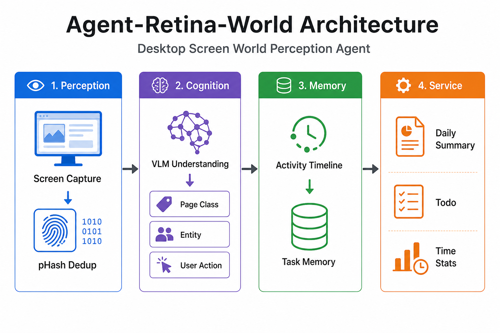
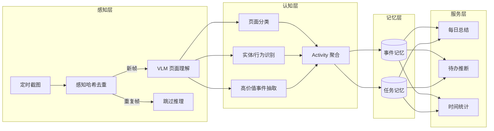
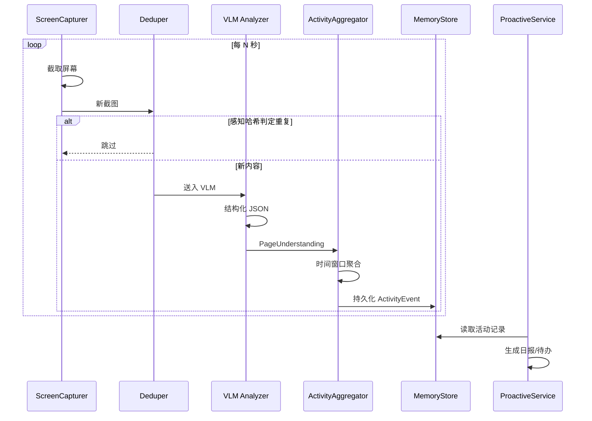

# Agent-Retina-World

**桌面屏幕世界感知 Agent** — 让 AI 理解你在电脑上做了什么，并主动提供服务。

> 个人原创项目 · v0.3



## v0.3 更新

- **真实 VLM 接入**：OpenAI 兼容多模态 API，Pydantic 校验 JSON，失败自动降级启发式
- **L3 embedding 语义去重**：基于窗口指纹 / 摘要向量的余弦相似度过滤
- **Web 时间线 UI**：`python main.py serve` 启动可视化面板（活动事件 + 时间分布）

## v0.2 更新

- **L2 直方图去重**：在 pHash 之后增加缩略图直方图相似度过滤
- **前台窗口感知**：Windows 下读取活动窗口标题与进程名，启发式理解无需 VLM
- **活动聚合优化**：同场景连续帧合并为单条事件，附带 `frame_count`
- **新命令**：`timeline` 活动时间线 · `stats` 运行统计
- **单元测试**：`python -m unittest discover -s tests`

## 项目亮点

1. **降本**：多阶段截图去重（感知哈希 + 语义相似度预留），显著减少 VLM 无效调用
2. **理解**：VLM 结构化输出 — 页面分类、文本块、实体、用户行为、高价值事件
3. **记忆**：单帧语义 → 连续 Activity 时间线，SQLite 任务/事件双记忆
4. **主动服务**：基于活动知识库生成每日总结、待办推断、时间分布统计

## 系统架构



## 数据流



## 模块说明

| 模块 | 路径 | 职责 |
| --- | --- | --- |
| 截图采集 | `capture/screen.py` | 多显示器截图，按时间戳归档 |
| 去重 | `dedup/hasher.py` | L1 pHash + L2 直方图相似度 |
| 页面理解 | `understand/vlm.py` | 启发式 / OpenAI 兼容 VLM |
| 前台上下文 | `capture/context.py` | Windows 活动窗口标题与进程 |
| 活动聚合 | `activity/store.py` | 时间序列事件构建与 SQLite 存储 |
| 主动服务 | `proactive/service.py` | 日报、待办、时间分布 |
| 编排 | `pipeline.py` | 全链路调度与统计 |

## 快速开始

```powershell
cd D:\Agent-Retina
python -m venv .venv
.\.venv\Scripts\Activate.ps1
pip install -r requirements.txt

python main.py once          # 采集并理解一帧
python main.py watch -i 30   # 定时监听
python main.py report        # 生成每日总结
python main.py timeline      # 查看活动时间线
python main.py stats         # 运行与去重统计
python main.py serve         # Web 时间线 UI → http://127.0.0.1:8765
python -m unittest discover -s tests
```

## 配置

复制 `config.example.yaml` 为 `config.yaml`。

### 启发式模式（默认）

`vlm.provider: heuristic` — 基于前台窗口，无需 API。

### 真实 VLM

```yaml
vlm:
  provider: openai_compatible
  base_url: https://your-api/v1
  model: qwen2.5-vl-7b-instruct
  api_key_env: VLM_API_KEY      # 推荐用环境变量
  fallback_heuristic: true      # API 失败时降级
```

### Embedding 语义去重

```yaml
embedding:
  enabled: true
  base_url: https://your-api/v1
  model: text-embedding-3-small
  api_key_env: EMBEDDING_API_KEY
  threshold: 0.92
```

## 路线图

- [x] L2 直方图二级去重
- [x] Windows 前台窗口感知
- [x] 活动时间线 CLI
- [x] embedding 语义去重
- [x] VLM 真实推理（OpenAI 兼容）
- [x] Web 时间线 UI
- [ ] 跨会话任务归并与证据追溯

## License

MIT
