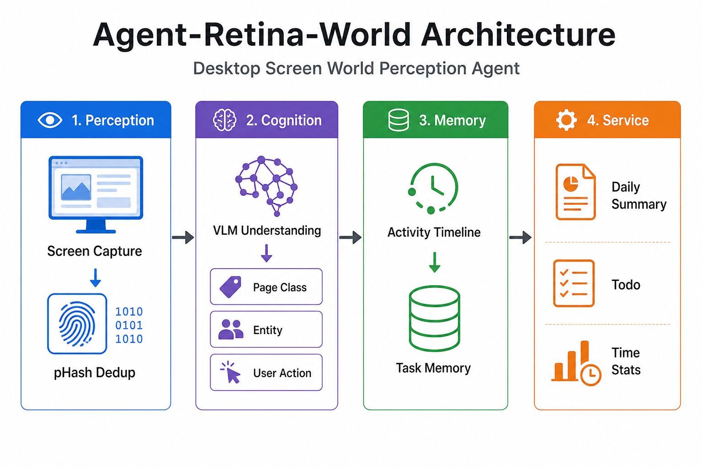
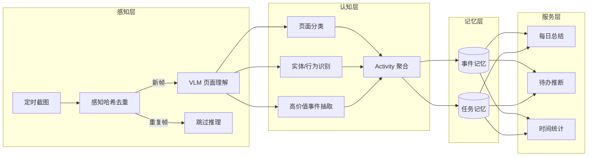
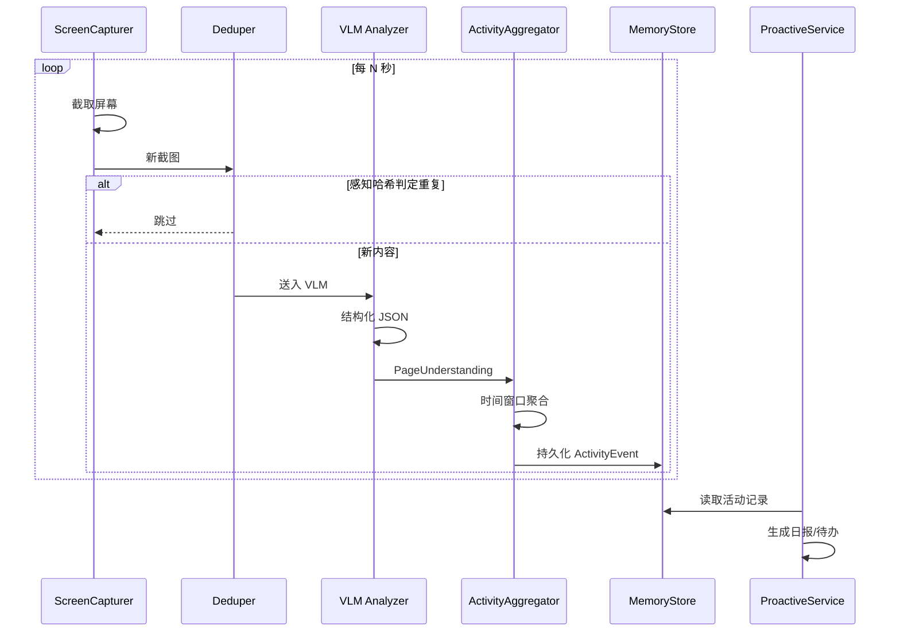

# Agent-Retina-World

**桌面屏幕世界感知 Agent** — 让 AI 理解你在电脑上做了什么，并主动提供服务。

> 个人原创项目 · v0.8



## 文档

| 文档 | 说明 |
| --- | --- |
| [记忆系统设计](docs/memory-design.md) | **三层记忆对标 Letta/Mem0/Zep/GA + 2026 最新研究（睡眠门控/类型衰减/溯源）** |
| [Agent 运行时架构](docs/agent-architecture.md) | **事件流 + 状态机 + 权限策略 + 规划，对标 OpenHands / goose / Cline / Pi** |
| --- | --- |
| [开发过程记录](docs/development-journal.md) | **版本演进、Git 时间线、简历叙事** |
| [变更日志](docs/CHANGELOG.md) | 按版本摘要 |
| [Plan 归档](docs/plans/README.md) | Cursor Plan 模式文档入库说明 |
| [架构设计](docs/architecture.md) | 系统设计 |
| [语音助手](docs/voice-assistant.md) | 唤醒、会话、指令 |
| [Demo 试跑](docs/demo-quickstart.md) | 5 步本地验证 |

## v1.0 更新 · Agent 运行时

- **会拆任务了**：「新建文件夹 素材 然后 把 桌面/报告.pdf 移动到 素材」拆成两步依次执行，每步结果实时回报
- **事件流驱动**：plan / action / observation / ask / state_changed 全走一条事件总线，UI 与日志都只是订阅者（对标 OpenHands 的 EventStream）
- **权限策略**：auto / approve / smart / chat 四种模式，可给单个工具记「以后别问」（对标 goose）；参数里带「删除 / 格式化」这类字眼一律先拦
- **挂起与恢复**：需要拍板的步骤挂起等一句话，答「继续 / 跳过 / 取消」接着走；说别的算改变方向，任务停掉、那句话正常走后续路由（对标 Pi 的 steering）
- **轨迹落盘**：任务 / 步骤 / 事件进 SQLite，重启后能查「昨天那个活儿做到哪了」
- 详见 [Agent 运行时架构](docs/agent-architecture.md)

## v0.9 更新 · 文件操作 + 交互式选项

- **文件写操作补齐**：新建文件夹 / 移动 / 复制 / 重命名 / 归档 / 撤销——此前只有只读（打开 · 列目录 · 找文件），「整理桌面文件」这类请求根本没有对应工具
- **安全边界**：写操作白名单（桌面 / 下载 / 文档 / 图片 / 视频 / 音乐）；删除走回收站不永久删；每次写操作记 journal，「撤销」整体回滚；重名自动加 `_1` 不覆盖
- **归档三阶段**：问怎么整理 → 出「源 → 目标」清单 → 确认才移动（对标 AI File Sorter 的 dry-run 与 Goose 的权限分级）
- **交互式选项**：需要用户拍板时在输入框上方渲染可点按钮，点选即作为下一条指令回传（`ask.options` 工具让模型也能主动提问）
- **修掉两处说空话的根因**：① `_chat` 的 registry 惰性初始化让首次对话拿不到工具列表 ② `打开\s*(.+)` 贪婪匹配把「打开qq给我的小号 发个消息」整句当应用名

## v0.8 更新 · 三层记忆系统（对标顶级 agent 记忆）

- **分层记忆**：情节层（屏幕活动 + importance 启发式）/ 语义层（画像·偏好·项目·实体 facts）/ 工作层（会话持久化，重启可恢复上次对话）
- **三维检索**（Generative Agents）：score = 0.4·recency（48h 半衰期）+ 0.3·importance + 0.3·relevance（CJK bigram 重叠）
- **写入对账**（Mem0）：同义新旧 fact 更新不追加，confidence 递增；每条 fact 强制 evidence 溯源（Agent Zero）
- **类型条件衰减**（ScrubJay 8 月）：profile 30 天 / preference 14 天 / project 7 天 / entity 3 天半衰期
- **睡眠门控固化**（Google/Cornell Sleep 范式）：idle 超 5 分钟才跑固化线程，交互零争用
- **上下文装配器**：system prompt = facts + 相关 episodes + 工作记忆，1200 token 预算
- 规则固化 v1（"我叫X"/"我喜欢X"/"我在做X"/"记住X" + 事件高频主题挖掘），LLM 候选提取留 hook（模型提议、规则裁决）

## v0.7 更新 · 流式语音 + Qt 悬浮球 + 多后端对话

```powershell
python main.py voice --download-model   # 下载 sherpa 模型套件（ASR/KWS/TTS，约 450MB）
python main.py voice                    # Qt 悬浮球（默认，Alt+Space 唤出输入条）
```

- **流式离线语音**：sherpa-onnx zipformer 双语模型，边说边识别（10s 音频 0.6s 出稿），彻底替换 Vosk 整段听写
- **真·关键词唤醒**：sherpa KWS 模型 spotting「瑞塔/小光/光光」（`r uì t ǎ @瑞塔`，pypinyin 自动生成 + 拼音缩写规则），待机 CPU <5%
- **自然音色 TTS**：vits 中文女声替换 pyttsx3 机器音，播报在独立线程且自动屏蔽麦克风防回环
- **音量呼吸环**：悬浮球光环随说话音量实时起伏
- **悬浮点 + 自动会话气泡**：44px 通透小圆点常驻桌面（状态用一圈极细流光表达）；**AI 回话自动浮出半透明气泡，不用点开任何窗口**，播报结束几秒后自动收起；**Alt+Space 唤出 Spotlight 式紧凑输入条**（有回复才生长，长文粘贴自动折叠）；系统托盘 + 开机自启 + 浅色/深色主题
- **打字 + 语音双输入**：面板打字与语音共用 `handle_command`，意图/对话历史/播报全共享
- **对话多后端**：`chat.backends` 按序探测——本地 vLLM（千问系列）优先，DeepSeek API 兜底，旧单后端配置兼容
- **「瑞塔，截图」一句话直达**：唤醒词命中后回放 3 秒音频缓冲，唤醒词和命令一句话说完

## v0.6 更新 · LLM 对话 Demo

```powershell
python main.py demo                    # 配置检查 + 悬浮球
python main.py voice --download-model  # 首次下载离线语音模型
```

- **自由对话**：未匹配命令的语句走 codexzh Chat（gpt-5.4-mini）
- **命令优先**：截图、打开应用等仍走规则意图，节省模型成本
- 详见 [docs/demo-quickstart.md](docs/demo-quickstart.md)

## v0.5 更新 · 免唤醒 + 离线 + 悬浮球

```powershell
python main.py voice --download-model   # 离线模型（一次）
python main.py voice                    # 默认悬浮球 UI
```

- **免唤醒连续对话**：唤醒一次，60 秒内直接说指令
- **离线语音识别**：Vosk 中文模型，无网可用（`stt_engine: auto`）
- **悬浮球 UI**：52px 可拖动，双击看日志

## v0.4 更新 · 语音常驻助手

**不用打字、不用对话窗口** — 呼唤名字直接说话：

```powershell
python main.py voice
```

说 **「瑞塔，截图」** · **「小光，打开百度」** · **「瑞塔，分析屏幕」**

桌面右侧常驻侧边栏，麦克风聆听 + 语音播报反馈。详见 [docs/voice-assistant.md](docs/voice-assistant.md)

## v0.3 更新

- **真实 VLM 接入**：OpenAI 兼容多模态 API，Pydantic 校验 JSON，失败自动降级启发式
- **L3 embedding 语义去重**：基于窗口指纹 / 摘要向量的余弦相似度过滤
- **Web 时间线 UI**：`python main.py serve` 启动可视化面板（活动事件 + 时间分布）

## v0.2 更新

- **L2 直方图去重**：在 pHash 之后增加缩略图直方图相似度过滤
- **前台窗口感知**：Windows 下读取活动窗口标题与进程名，启发式理解无需 VLM
- **活动聚合优化**：同场景连续帧合并为单条事件，附带 `frame_count`
- **新命令**：`timeline` 活动时间线 · `stats` 运行统计
- **单元测试**：`python -m unittest discover -s tests`

## 项目亮点

1. **降本**：多阶段截图去重（感知哈希 + 语义相似度预留），显著减少 VLM 无效调用
2. **理解**：VLM 结构化输出 — 页面分类、文本块、实体、用户行为、高价值事件
3. **记忆**：单帧语义 → 连续 Activity 时间线，SQLite 任务/事件双记忆
4. **主动服务**：基于活动知识库生成每日总结、待办推断、时间分布统计

## 系统架构


```mermaid
flowchart LR
    subgraph 感知层
        A[定时截图] --> B[感知哈希去重]
        B -->|新帧| C[VLM 页面理解]
        B -->|重复帧| X[跳过推理]
    end

    subgraph 认知层
        C --> D[页面分类]
        C --> E[实体/行为识别]
        C --> F[高价值事件抽取]
        D & E & F --> G[Activity 聚合]
    end

    subgraph 记忆层
        G --> H[(事件记忆)]
        G --> I[(任务记忆)]
    end

    subgraph 服务层
        H & I --> J[每日总结]
        H & I --> K[待办推断]
        H & I --> L[时间统计]
    end
```

## 数据流


```mermaid
sequenceDiagram
    participant S as ScreenCapturer
    participant D as Deduper
    participant V as VLM Analyzer
    participant A as ActivityAggregator
    participant M as MemoryStore
    participant P as ProactiveService

    loop 每 N 秒
        S->>S: 截取屏幕
        S->>D: 新截图
        alt 感知哈希判定重复
            D-->>S: 跳过
        else 新内容
            D->>V: 送入 VLM
            V->>V: 结构化 JSON
            V->>A: PageUnderstanding
            A->>A: 时间窗口聚合
            A->>M: 持久化 ActivityEvent
        end
    end
    P->>M: 读取活动记录
    P->>P: 生成日报/待办
```

## 模块说明

| 模块 | 路径 | 职责 |
| --- | --- | --- |
| 截图采集 | `capture/screen.py` | 多显示器截图，按时间戳归档 |
| 去重 | `dedup/hasher.py` | L1 pHash + L2 直方图相似度 |
| 页面理解 | `understand/vlm.py` | 启发式 / OpenAI 兼容 VLM |
| LLM 对话 | `understand/chat.py` | OpenAI 兼容 Chat 多后端（vLLM 千问 / DeepSeek） |
| 前台上下文 | `capture/context.py` | Windows 活动窗口标题与进程 |
| 活动聚合 | `activity/store.py` | 时间序列事件构建与 SQLite 存储 |
| 主动服务 | `proactive/service.py` | 日报、待办、时间分布 |
| 语音助手 | `voice/` | STT、意图、悬浮球 UI |
| 编排 | `pipeline.py` | 全链路调度与统计 |

## 快速开始

```powershell
cd D:\Agent-Retina
python -m venv .venv
.\.venv\Scripts\Activate.ps1
pip install -r requirements.txt

python main.py once          # 采集并理解一帧
python main.py watch -i 30   # 定时监听
python main.py report        # 生成每日总结
python main.py timeline      # 查看活动时间线
python main.py stats         # 运行与去重统计
python main.py serve         # Web 时间线 UI
python main.py voice         # 悬浮球语音助手（默认）
python main.py demo          # 最小 Demo（配置检查 + voice）
python main.py voice --ui sidebar
python main.py voice --download-model
python -m unittest discover -s tests
```

## 配置

复制 `config.example.yaml` 为 `config.yaml`。

### 启发式模式（默认）

`vlm.provider: heuristic` — 基于前台窗口，无需 API。

### 真实 VLM

```yaml
vlm:
  provider: openai_compatible
  base_url: https://your-api/v1
  model: qwen2.5-vl-7b-instruct
  api_key_env: VLM_API_KEY      # 推荐用环境变量
  fallback_heuristic: true      # API 失败时降级
```

### Embedding 语义去重

```yaml
embedding:
  enabled: true
  base_url: https://your-api/v1
  model: text-embedding-3-small
  api_key_env: EMBEDDING_API_KEY
  threshold: 0.92
```

## 路线图

- [x] L2 直方图二级去重
- [x] Windows 前台窗口感知
- [x] 活动时间线 CLI
- [x] embedding 语义去重
- [x] VLM 真实推理（OpenAI 兼容）
- [x] Web 时间线 UI
- [x] 语音唤醒常驻助手（呼唤名字操作）
- [x] LLM 自由对话（多后端：本地 vLLM 千问 / DeepSeek API）
- [x] v0.7 流式离线语音 + KWS 唤醒 + vits TTS + Qt 悬浮球
- [x] v0.8 三层记忆系统（分层 + 三维检索 + 对账 + 睡眠门控固化）
- [x] P1 向量检索（硅基流动 bge-m3 免费）+ 梦境期 LLM 提取 + supersede 对账 + 反思回填
- [x] P2 前瞻记忆（到点主动提醒）+ 梦境重组（跨域找连接）+ 记忆评测基准（benchmarks/memory_eval.py 7 场景）
- [x] v0.9 文件操作工具集（白名单 / 回收站 / 可撤销）+ 目录归档三阶段 + 交互式选项
- [x] v1.0 Agent 运行时（事件流 / 状态机 / 权限策略 / 规划 / 轨迹持久化）
- [ ] 跨会话任务归并与证据追溯
- [ ] Agent 任务续跑：启动时检测未完成任务并提示接着做

## License

MIT
