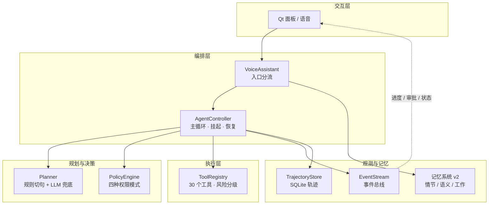
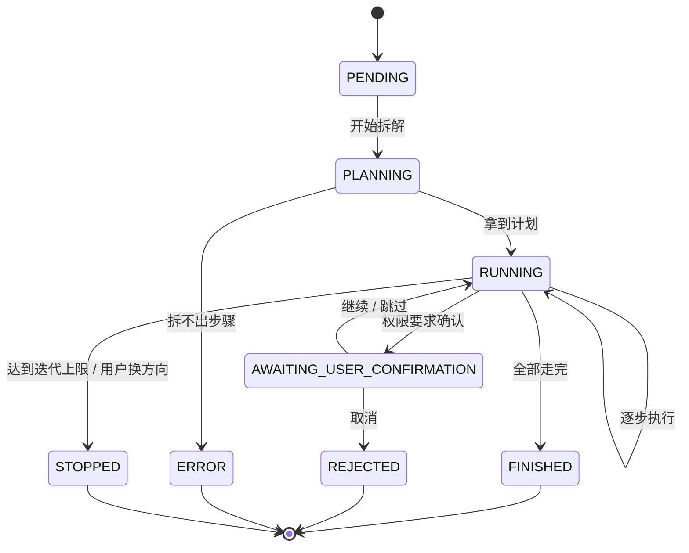

# Agent 运行时架构

对标 OpenHands / block-goose / Cline / Pi 四家之后落地的一套轻量 Agent 架构。
不追求功能堆满，追求**每一块都说得清为什么存在**。

## 分层



依赖是单向的：`agent/*` 不依赖任何 UI，UI 只订阅事件流。所以加一路观测（日志、Web 面板、
未来的手机端）不用碰主循环。

## 模块

| 模块 | 职责 | 对标 |
| --- | --- | --- |
| `agent/events.py` | 事件总线 + 事件类型（plan / action / observation / ask / state_changed / finish） | OpenHands EventStream、Pi 的审计轨迹 |
| `agent/state.py` | 任务状态机（9 态，非法跳转直接拒）+ 步骤记录 + 断点游标 | OpenHands AgentState、Cline TaskState |
| `agent/policy.py` | 四种权限模式 + 工具级覆盖 + 危险参数拦截 | block/goose 的 GooseMode 与 PermissionLevel |
| `agent/planner.py` | 复合句切分给意图层试跑；切不动交 LLM 出 JSON 并强校验 | Cline Plan 模式 |
| `agent/controller.py` | 主循环：规划 → 逐步执行 → 审批挂起 → 恢复 → 汇总 | OpenHands AgentController |
| `agent/trajectory.py` | 任务 / 步骤 / 事件落 SQLite，支持续跑 | Cline 任务持久化、Pi 的 JSONL 会话 |

## 任务生命周期



三条不变量：

1. **任何一步执行前必过 `policy.judge`**，没有绕过路径
2. **挂起不丢现场**：游标停在原地，`try_resume` 从原处接着走
3. **失败不吞**：单步失败如实记 FAILED 并继续，最后汇总里报出来

## 权限决策

判定顺序（越靠前越硬）：

| 顺序 | 条件 | 结果 |
| --- | --- | --- |
| 1 | `chat` 模式 | 全部拒绝 |
| 2 | 工具被设为 NeverAllow | 拒绝 |
| 3 | 工具被设为 AlwaysAllow | 放行 |
| 4 | 工具被设为 AskBefore | 确认 |
| 5 | 参数里带「删除 / 格式化 / 覆盖」等字眼 | **确认**（信任工具≠信任这次调用） |
| 6 | `auto` 且 `auto_allows_high` | 放行 |
| 7 | 发生在 `files.delete` 这类不可逆工具上 | 确认 |
| 8 | `approve` 模式 | 只读放行，其余确认 |
| 9 | `smart` 模式 | SAFE/LOW 放行，HIGH 确认 |
| 10 | `auto` 模式 | 放行，但 HIGH 仍需确认（除非第 6 条打开） |

模式在 `config.yaml` 的 `agent.permission_mode` 配置，工具级覆盖落
`data/agent/policy.json`，跨会话记住「以后都别问」。

## 续跑与轨迹

`data/agent/tasks.db` 三张表：`tasks`（任务级状态与游标）、`steps`（每步的
Action/Observation 与耗时）、`events`（plan/action/observation/ask/finish 快照）。

`TrajectoryStore.latest_unfinished()` 取最近一条没跑完的任务，用于启动时提示续跑。
落盘失败不影响本次执行——可观测性不能变成可用性的负担。

## 从 Pi 借的两个机制

**Steering vs Follow-up 双队列。** 任务挂起时用户说「继续」是回答问题，说别的则是
改变方向——此时任务记为 STOPPED，那句话交回正常路由，不会被吞掉。想「做完这件再做那件」
用 `follow_up()` 排进队列。

**并行只读步骤。** 连续的安全步骤（`SAFE` 且放行）攒一批用线程池并行跑，有副作用的
一律串行；并行的候选同样要过打转检测，不能让并行这条路径绕开它。

## 配置

```yaml
agent:
  enabled: true
  permission_mode: smart   # auto | approve | smart | chat
  max_steps: 5
```

## 测试

`tests/test_agent_core.py` 37 例：事件流、状态机（含非法跳转）、权限十种组合、
规划器（规则 / LLM / 校验 / 拒单步）、轨迹读写、主循环（多步执行 / 挂起确认 / 跳过 /
取消 / 换方向 / 打转检测），以及 assistant 的分流接线。
主循环用例全程在临时目录里跑真实工具，删除动作换成假实现——不碰真实桌面，也不污染回收站。
