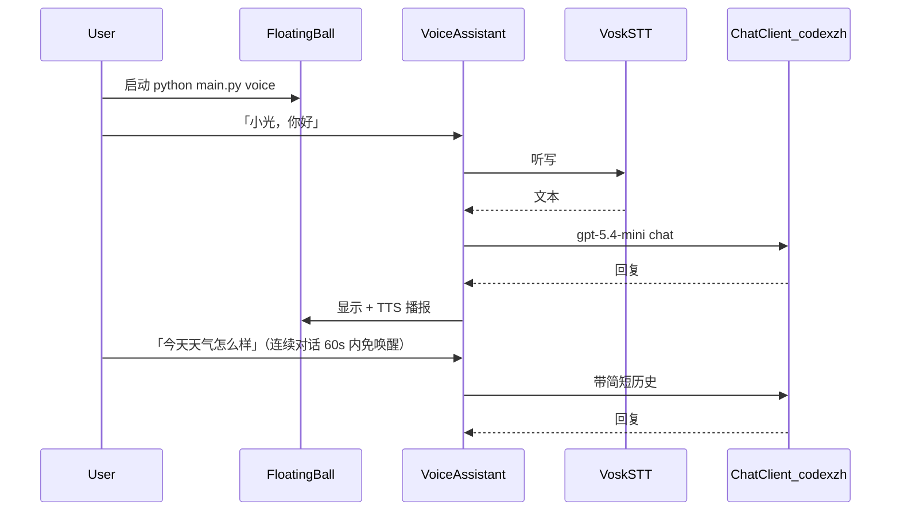

# Agent-Retina 最小可跑 Demo 计划

> **本项目唯一一份 Cursor Plan 原文件归档**  
> 原路径：`C:\Users\mi\.cursor\plans\最小语音对话_demo_b578bbfe.plan.md`  
> 执行 commit：`588be2d`

## 现状结论

**已经有的（可直接复用）：**

- 桌面悬浮球 UI：`src/screen_agent/voice/floating_ball.py` — 52px 置顶、可拖动、双击看日志
- 语音链路：Vosk/Google STT → 唤醒词 → 规则意图 → `CommandExecutor`
- 启动命令：`python main.py voice`（`main.py`）

**还缺的（Demo 卡点）：**

- 未匹配指令时只返回固定文案「我还没学会这个…」，**没有 LLM 对话**
- 配置里没有 `chat` 段，项目无纯文本 Chat 客户端

## 模型与 API 来源（已核实）

| 来源 | 内容 |
| --- | --- |
| 本机 Codex | `~/.codex/config.toml` → `base_url = https://api.codexzh.com/v1`，provider = codexzh |
| 本机密钥 | `~/.codex/auth.json` → `OPENAI_API_KEY`（Demo 直接复用，**不写入 Git**） |
| 有道云 | 05-敏感配置下有 codexzh 相关信息；Demo 优先读本机 auth.json |

**模型策略（按你的要求）：**

1. 默认 `gpt-5.4-mini`（省钱）
2. 若 API 返回 model not found / 400，自动回退 `gpt-5.4`
3. **禁止** 使用 `gpt-5.5`

## 目标体验（最小验证）

**本轮不做（保持最小）：**

- 后台自动每 30s 截屏 watch（费模型）
- Web 聊天页、复杂 Agent 工具链
- 有道云自动拉密钥

## 实现方案

### 1. 新增 Chat 客户端模块

新建 `src/screen_agent/understand/chat.py`：

- `OpenAICompatibleChatClient` — httpx 调 `POST {base_url}/chat/completions`
- `build_chat_client(chat_cfg)` — 用现有 `resolve_secret`
- `resolve_chat_api_key()` — 环境变量 → `~/.codex/auth.json`
- 先 `gpt-5.4-mini`，失败再 `gpt-5.4`

### 2. 配置

`config.example.yaml` 增加 `chat:` 段（base_url、model、max_tokens、max_history）

### 3. 语音路由：命令优先，其余走 Chat

- 新增 `IntentType.CHAT`
- 未匹配 → CHAT（不再 UNKNOWN）
- Executor 注入 ChatClient + 对话历史

### 4. UI 小改

- 悬浮球启动自动展开 popover
- TTS 截断 120 → 200

### 5. CLI 与文档

- `python main.py demo`
- `docs/demo-quickstart.md`
- 更新 `docs/voice-assistant.md`

### 6. 测试

- 自由文本 → CHAT；固定指令仍优先
- Mock ChatClient 测 executor

### 7. Git

- Commit：`feat: 接入 codexzh 对话，支持悬浮球最小 Demo 验证`
- 不提交密钥

## 你本地试跑检查清单

1. 麦克风权限正常
2. `python main.py voice --download-model` 已完成
3. 密钥：`~/.codex/auth.json` 或 `$env:OPENAI_API_KEY`
4. 「小光，你好」→ 回复 + 语音播报
5. 60 秒内「讲个笑话」免唤醒
6. 「截图」走命令，不调 Chat

## 成本控管

- `max_tokens: 256`
- 只有非命令语句才调 LLM
- 默认 gpt-5.4-mini，失败才 gpt-5.4
